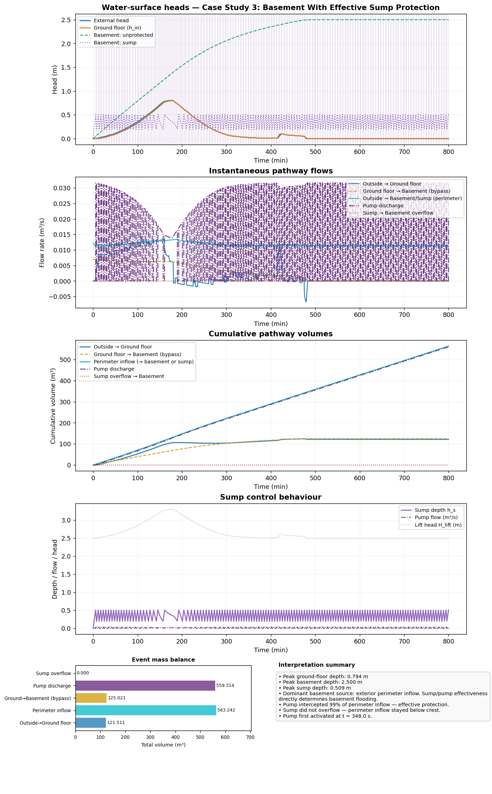
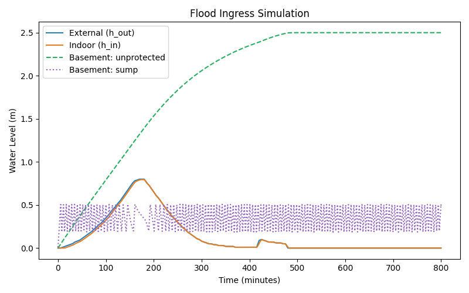
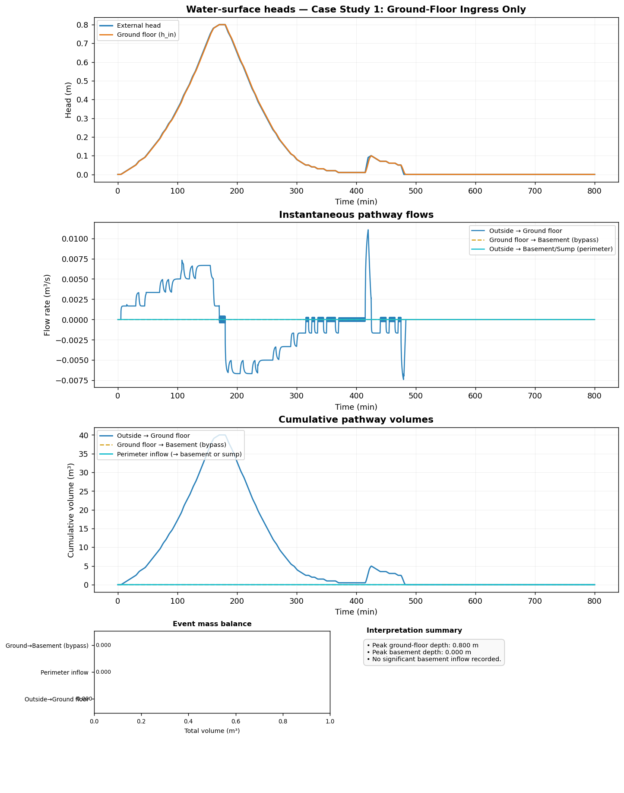
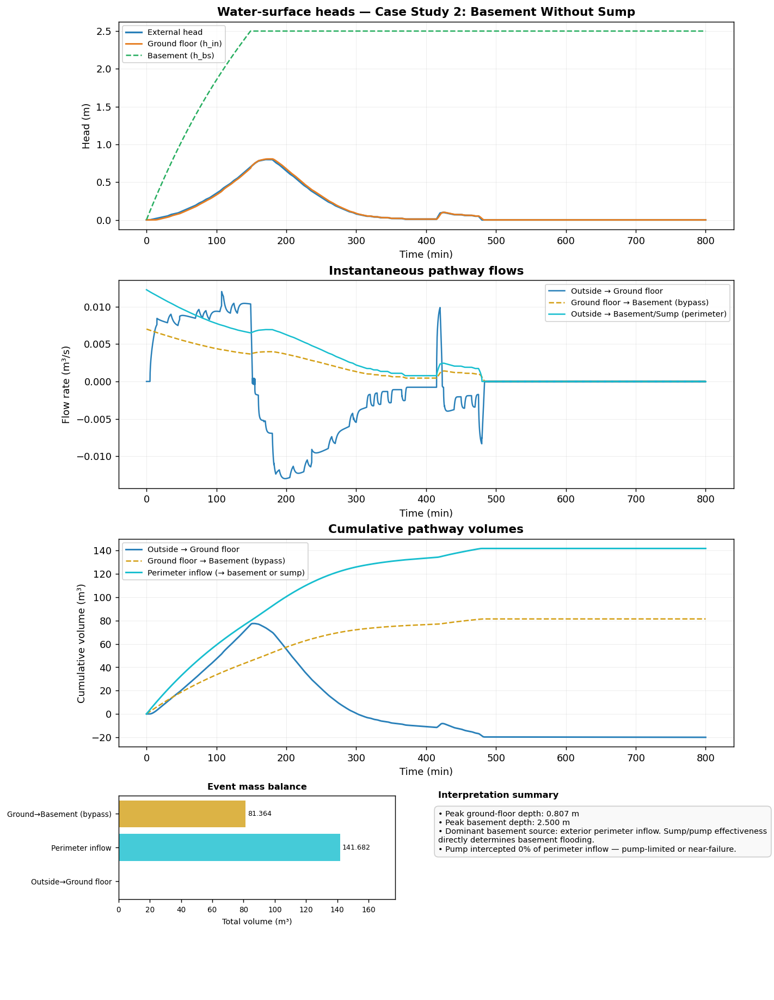
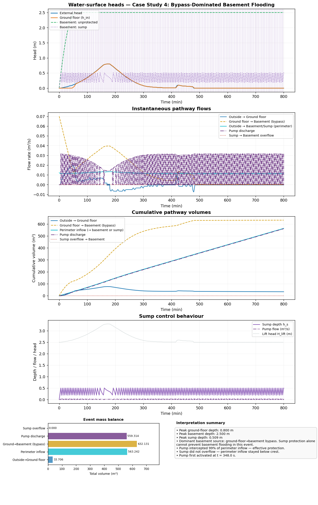
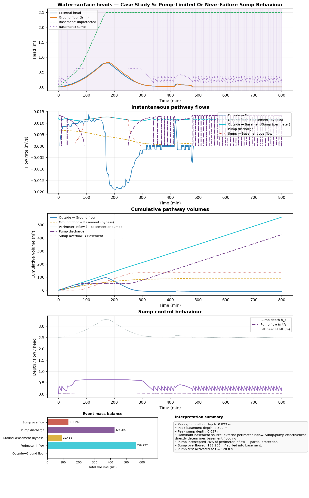

# Interpretation Dashboard Tutorial

This tutorial explains the advanced event-interpretation dashboard added to the Streamlit app.

The goal is not just to show water levels, but to answer the hydraulic questions behind a run:

- which pathway dominated the event
- when the basement first became engaged
- whether the sump and pump were effective
- whether flooding was driven by perimeter inflow, by the building-to-basement bypass, or by both

---

## 1. What Was Implemented

The new interpretation layer adds three pieces:

1. A diagnostics layer that reads the per-step trace emitted by the solver and records:
   - chamber heads and depths
   - pathway flows
   - cumulative pathway volumes
   - pump state and pump lift head
   - key event timings

2. A multi-panel interpretation dashboard in the Streamlit app showing:
   - water-surface heads on a common datum
   - instantaneous pathway flows
   - cumulative pathway volumes
   - sump control behaviour and thresholds
   - a pathway schematic with total transferred volumes
   - an automatic narrative summary

3. A downloadable diagnostics CSV containing timestep-level values for post-processing.

---

## 2. Where To Find It In Streamlit

Run the app:

```bash
streamlit run streamlit_app.py
```

After a simulation finishes, the app now shows:

- the original simulation result plot
- an **Advanced interpretation** section
- a dashboard image
- pathway and timing tables
- a narrative summary
- a downloadable diagnostics CSV

Representative dashboard view:



Matching standard result plot:



---

## 3. How To Read The Dashboard

### 3.1 Water-Surface Heads

This panel plots chamber water-surface elevations on a common datum.

Use it to answer:

- when the external flood peaks
- when the ground floor, basement, and sump respond
- whether the sump stays below its overflow crest
- whether the basement approaches its storage limit

If a sump is enabled, shaded regions indicate periods when the pump is on.

### 3.2 Instantaneous Pathway Flows

This panel shows the time-varying flow rates through the main pathways.

Use it to identify:

- when exterior inflow is strongest
- whether the ground-to-basement bypass becomes important
- whether pump discharge keeps pace with intercepted inflow
- whether sump overflow is active

### 3.3 Cumulative Volumes

This panel integrates pathway flows over the whole event.

It is often the fastest way to understand the event:

- if `Outside -> Sump` and `Pump discharge` nearly overlap, the pump protected the perimeter inflow well
- if `Ground floor -> Basement` dominates, the bypass is the real basement driver
- if `Sump -> Basement overflow` is large, the sump system is under-sized for the event

### 3.4 Control And Thresholds

For sump-enabled runs this panel focuses on:

- sump depth
- pump-on threshold
- pump-off threshold
- overflow crest
- pump discharge

This is the best panel for diagnosing cycling, near-overflow behaviour, or an over-aggressive or weak pump.

### 3.5 Pathway Schematic

This schematic gives a single-event mass-balance view.

Use it to see how much total water moved through:

- outside to ground floor
- outside to basement system
- ground floor to basement
- sump to pump discharge
- sump overflow to basement

### 3.6 Event Summary

This panel is a machine-written hydraulic summary of the run.

It combines:

- peaks and their timings
- dominant basement source
- pump/interception ratio
- automatically generated interpretation bullets

---

## 4. Implementation Overview

The interpretation view is built from two code layers:

- [diagnostics.py](/Users/roberto/repos/waterIngressBuilding/diagnostics.py)
  This reads the simulation trace and records detailed pathway-level diagnostics without replaying the hydraulics in a second solver loop.

- [viz.py](/Users/roberto/repos/waterIngressBuilding/viz.py)
  This turns the diagnostics into the multi-panel dashboard.

The Streamlit app then:

1. parses the user inputs
2. runs the simulation
3. derives diagnostics from the stored solver trace
4. renders both the original result plot and the new dashboard
5. exposes tables, narrative notes, and a diagnostics CSV download

Relevant integration points:

- [streamlit_app.py](/Users/roberto/repos/waterIngressBuilding/streamlit_app.py)
- [diagnostics.py](/Users/roberto/repos/waterIngressBuilding/diagnostics.py)
- [viz.py](/Users/roberto/repos/waterIngressBuilding/viz.py)

The tutorial figures embedded below are generated from the same example definitions using:

```bash
./.venv/bin/python example_run/generate_interpretation_tutorial_assets.py
```

That script writes the dashboard PNGs into `docs/assets/interpretation_dashboard/`.
For each case study it also writes a matching standard simulation-result PNG, so the tutorial has both the compact water-level view and the richer interpretation dashboard.

---

## 5. Case Studies

The case studies below are designed to teach the dashboard, not just to run the model.

All commands assume the repository root as the working directory.

### Case Study 1: Ground-Floor Ingress Only

Purpose:

- learn the baseline event without basement complexity

Command:

```bash
./.venv/bin/python main.py \
  --external example_run/example_external_levels.csv \
  --ingress example_run/example_ingress_paths.txt \
  --floor 50 \
  --dt 0.1 \
  --outdir example_run/case1_ground_only
```

What to look for:

- heads panel: only external and ground-floor heads are active
- flows panel: `Outside -> Ground floor` dominates
- schematic: no basement or sump pathways appear



The image below this case is useful as the baseline reference for every later comparison.

### Case Study 2: Basement Without Sump

Purpose:

- learn how the basement responds when both perimeter ingress and the building-to-basement bypass are active

Command:

```bash
./.venv/bin/python main.py \
  --external example_run/example_external_levels.csv \
  --ingress example_run/example_ingress_paths.txt \
  --floor 50 \
  --dt 0.1 \
  --basement-area 50 \
  --basement-floor-elevation -2.5 \
  --basement-ingress-height 0.0 \
  --basement-ingress-area 0.0035 \
  --basement-ingress-coeff 0.5 \
  --basement-connection-height 0.0 \
  --basement-connection-area 0.001 \
  --outdir example_run/case2_basement_no_sump
```

What to look for:

- cumulative volumes: compare `Outside -> Basement direct` with `Ground floor -> Basement`
- summary text: identify the dominant basement source
- heads panel: note whether the basement keeps filling after the exterior hydrograph peak



This is the first case where the pathway schematic becomes important, because the basement can now be fed by more than one route.

### Case Study 3: Basement With Effective Sump Protection

Purpose:

- show a case where the sump and pump successfully intercept perimeter inflow

Command:

```bash
./.venv/bin/python main.py \
  --external example_run/example_external_levels.csv \
  --ingress example_run/example_ingress_paths.txt \
  --floor 50 \
  --dt 0.1 \
  --basement-area 50 \
  --basement-floor-elevation -2.5 \
  --basement-ingress-height 0.0 \
  --basement-ingress-area 0.0035 \
  --basement-ingress-coeff 0.5 \
  --basement-connection-height 0.0 \
  --basement-connection-area 0.001 \
  --sump-area 8.0 \
  --sump-base-elevation -2.5 \
  --sump-overflow-level 0.8 \
  --pump-on-level 0.5 \
  --pump-off-level 0.2 \
  --pump-shutoff-head 3.5 \
  --pump-curve-coeff 800.0 \
  --pipe-loss-coeff 200.0 \
  --outdir example_run/case3_basement_sump_effective
```

What to look for:

- cumulative volumes: `Outside -> Sump` should be close to `Pump discharge`
- control panel: the sump should cycle between the pump thresholds and remain below the overflow crest
- narrative summary: the pump should be described as protecting intercepted inflow effectively


This is the most balanced example in the tutorial and is usually the best one to show first when introducing the advanced dashboard to someone new.

### Case Study 4: Bypass-Dominated Basement Flooding

Purpose:

- demonstrate that a well-performing sump can still coincide with severe basement flooding if the building-to-basement bypass is large

Command:

```bash
./.venv/bin/python main.py \
  --external example_run/example_external_levels.csv \
  --ingress example_run/example_ingress_paths.txt \
  --floor 50 \
  --dt 0.1 \
  --basement-area 50 \
  --basement-floor-elevation -2.5 \
  --basement-ingress-height 0.0 \
  --basement-ingress-area 0.0035 \
  --basement-ingress-coeff 0.5 \
  --basement-connection-height 0.0 \
  --basement-connection-area 0.010 \
  --sump-area 8.0 \
  --sump-base-elevation -2.5 \
  --sump-overflow-level 0.8 \
  --pump-on-level 0.5 \
  --pump-off-level 0.2 \
  --pump-shutoff-head 3.5 \
  --pump-curve-coeff 800.0 \
  --pipe-loss-coeff 200.0 \
  --outdir example_run/case4_bypass_dominated
```

What to look for:

- cumulative volumes: `Ground floor -> Basement` should dominate
- narrative summary: the dominant basement source should switch to the bypass
- schematic: the pump can still show strong `Pump discharge` while the basement remains badly affected



This image is especially helpful for explaining that a visibly active sump does not necessarily mean the basement is protected overall.

### Case Study 5: Pump-Limited Or Near-Failure Sump Behaviour

Purpose:

- show what an under-sized or head-limited sump system looks like in the dashboard

Command:

```bash
./.venv/bin/python main.py \
  --external example_run/example_external_levels.csv \
  --ingress example_run/example_ingress_paths.txt \
  --floor 50 \
  --dt 0.1 \
  --basement-area 50 \
  --basement-floor-elevation -2.5 \
  --basement-ingress-height 0.0 \
  --basement-ingress-area 0.0035 \
  --basement-ingress-coeff 0.5 \
  --basement-connection-height 0.0 \
  --basement-connection-area 0.001 \
  --sump-area 4.0 \
  --sump-base-elevation -2.5 \
  --sump-overflow-level 0.6 \
  --pump-on-level 0.35 \
  --pump-off-level 0.15 \
  --pump-shutoff-head 2.8 \
  --pump-curve-coeff 1400.0 \
  --pipe-loss-coeff 300.0 \
  --outdir example_run/case5_pump_limited
```

What to look for:

- control panel: sump depth approaches or exceeds the overflow crest
- cumulative volumes: `Sump -> Basement overflow` becomes visible
- narrative summary: the pump/interception ratio drops and the event is described as pump-limited or near-failure



This is the clearest figure for discussing undersized pumps, flood-level sensitivity, and the difference between interception and full protection.

---

## 6. Practical Interpretation Rules

These simple rules are usually reliable:

- If `Outside -> Sump` is large and `Pump discharge` is nearly equal, the sump is working.
- If `Ground floor -> Basement` is large, the basement bypass is the main basement problem.
- If `Sump -> Basement overflow` is near zero, the sump did not overflow.
- If the basement still floods while the sump is effective, the sump is not the bottleneck.
- If the pump cycles very frequently, the chosen `dt` and thresholds are important to interpretation.
- If the sump stays close to the overflow crest, the system is in a narrow safety margin.

---

## 7. Recommended Teaching Sequence

If you are using this dashboard to explain the model to someone else, the easiest sequence is:

1. Case Study 1 to learn the base event.
2. Case Study 2 to add the basement.
3. Case Study 3 to add an effective sump.
4. Case Study 4 to explain why a sump can work well and still not solve basement flooding.
5. Case Study 5 to show a genuinely under-sized sump system.

That progression makes the hydraulic interpretation much clearer than jumping directly to the full basement+sump+pump case.
