# Water Ingress Simulation — Validation Case Studies

Eleven cases arranged in a **2 × 2 matrix** of
(single hydrograph / batch ensemble) × (deterministic / fragility MC):

| | Single hydrograph | Batch (20 hydrographs, peaks 0.10–1.05 m) |
|---|---|---|
| **No fragility / membrane** | Cases 01–06 | **Case 10** |
| **Fragility / membrane MC** | Cases 07–09 | **Case 11** |

All cases share the same **triangular hydrograph shape**
(rise to peak at t = 30 min, drain to zero by t = 60 min,
dry tail to t = 360 min).
Single-hydrograph cases use a **0.5 m peak**.
Batch cases sweep peaks from **0.10 m to 1.05 m** (20 files, 0.05 m steps).

Ground-floor cases: **50 m²** floor area (small UK terraced house).
Basement cases add a **30 m²** partial basement at **−2.5 m**.

---

## Case 01 — Ground floor only, single large opening (sill = 0 m)

**Setup:** one orifice pathway (failed door flood-seal), sill at ground
level, area = 0.05 m², C_d = 0.6, floor area = 50 m².
Simulation timestep **Δt = 6 s** (see timestep sensitivity note below).

Characteristic response time:
τ = A\_floor · h\_max / Q\_max = 50 × 0.5 / 0.094 ≈ **266 s ≈ 4.4 min**

**Expected behaviour:** inflow begins immediately at t = 0.  The large
orifice equilibrates the interior with the exterior within a few
minutes.  Interior depth closely tracks external depth throughout the
flood and drains back out rapidly after t = 60 min.

**Qualitative check:** interior and exterior curves nearly coincide;
drainage complete by ≈ t = 70 min.

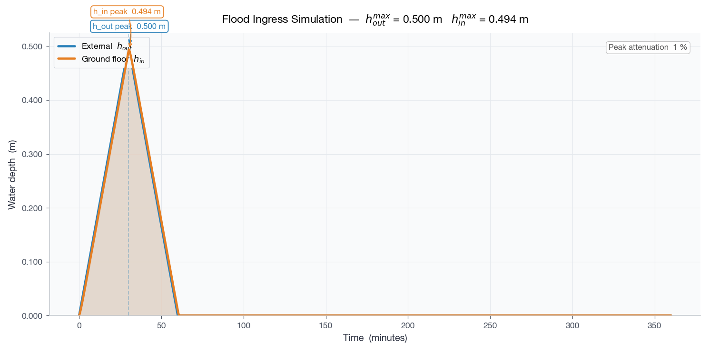

[Animation (GIF)](ex01/out/simulation_animation.gif)

### Timestep sensitivity — explicit-Euler accuracy

With the corrected 50 m² floor the scheme is stable at dt = 60 s
(Δt/τ = 0.23), but the explicit-Euler method still carries a systematic
positive bias: each step slightly overshoots equilibrium.  The table
below (computed with the 50 m² floor) shows how the peak depth error
converges as Δt shrinks.

| Δt | Δt / τ | Peak h\_in (m) | Error vs 1-s ref |
|---|---|---|---|
| 60 s (1 min) | 0.23 | 0.506 | +1.1 % |
| 30 s | 0.11 | 0.500 | +0.3 % |
| 15 s | 0.06 | 0.499 | < 0.1 % |
| **6 s (fix)** | **0.023** | **0.494** | **< 0.3 %** |
| 1 s (ref) | 0.004 | 0.494 | — |

**Note:** with the original, unrealistically small 10 m² floor the
same orifice gave Δt/τ = 0.57 and caused catastrophic oscillation
(peak error +28 %).  Correcting the geometry eliminated the instability;
the residual bias at Δt = 6 s is negligible (<0.3 %).

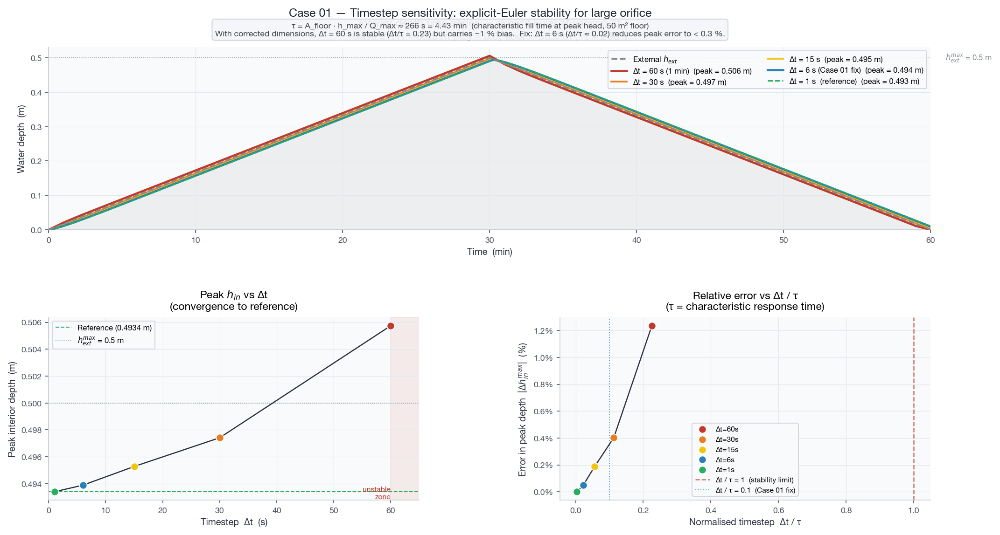

---

## Case 02 — Raised sill (sill = 0.3 m)

**Setup:** identical to Case 01 (50 m² floor, A = 0.05 m², Δt = 6 s)
except the sill is raised to 0.3 m, representing a flood barrier or
raised threshold.

**Expected behaviour:** no inflow until the external depth exceeds
0.3 m (t ≈ 18 min on the rising limb).  After the flood recedes,
water above the sill drains back out.  Water below the sill height
(0.3 m) is **permanently trapped** — the orifice model requires h > sill
on at least one side to permit flow, so once both interior and exterior
drop below 0.3 m there is no pathway for the residual water to escape.

**Qualitative check:** interior trace flat (zero) until t ≈ 18 min;
kink clearly visible at sill-crossing; residual interior depth converges
to ≈ 0.30 m and remains constant for the rest of the simulation.

[Animation (GIF)](ex02/out/simulation_animation.gif)

---

## Case 03 — Two openings: base crack + door gap

**Setup:** 50 m² floor, two pathways —
* Pathway A (`base_crack`): sill = 0.0 m, area = 0.001 m² — small
  permanent crack, active throughout
* Pathway B (`door_gap`): sill = 0.3 m, area = 0.005 m² — door gap,
  activates once exterior exceeds 0.3 m

Simulation extended to 360 min so the slow post-flood crack drainage
is fully visible.

**Expected behaviour:** slow linear rise while only Pathway A is
active.  At t ≈ 18 min Pathway B opens and the fill rate jumps by
~5×.  After the flood (t > 60 min) both pathways initially drain the
interior; once h\_in drops below 0.3 m only the crack remains active
and drainage slows dramatically.  Interior returns to zero by ≈ t = 360 min.

**Qualitative check:** clear inflection near t ≈ 18 min; drainage
curve shows two distinct slopes (fast above 0.3 m, slow below 0.3 m);
interior reaches zero by end of 6-hour window.

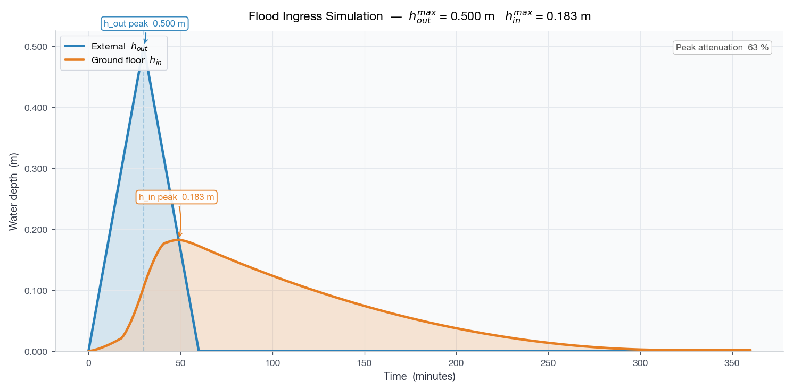

[Animation (GIF)](ex03/out/simulation_animation.gif)

---

## Case 04 — Basement compartment (no ground-floor opening)

**Setup:** 50 m² ground floor (no effective opening), 30 m² partial
basement, floor at −2.5 m (full-height UK basement, total void ≈ 75 m³).
Lumped exterior→basement perimeter opening: sill = 0 m, area = 0.005 m²,
C_d = 0.5.  No pump.

The perimeter sill is at ground level (0 m), so its effective head is
simply h\_ext (the exterior flood depth); the basement water surface
(below ground) exerts no back-pressure.  Maximum inflow:
Q\_max = 0.5 × 0.005 × √(2g × 0.5) ≈ **0.008 m³/s**.

Without a pump, once the flood recedes (h\_ext → 0) the basement water
is **permanently trapped** — it cannot drain back through a sill at 0 m
when the exterior is dry.

**Expected behaviour:** ground-floor trace identically zero; basement
fills steadily during the 60-min flood, reaching ≈ 0.6 m depth (above
floor) by t = 60 min; level remains constant thereafter.

**Qualitative check:** ground-floor trace = 0; basement trace rises
monotonically during flood and plateaus after t = 60 min.

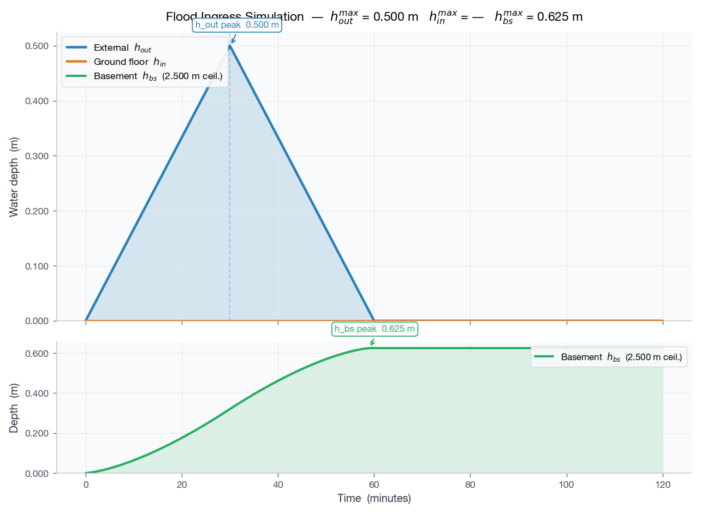

[Animation (GIF)](ex04/out/simulation_animation.gif)

---

## Case 05 — Basement + sump/pump (pump keeps up)

**Setup:** identical inflow to Case 04 (30 m² basement, z = −2.5 m).
Added sump (area = 0.5 m², base at −2.5 m, overflow crest at 0.8 m
above base).  Strong pump: k\_pump = 1 000.

Q\_pump = √((H\_shut − H\_lift) / k\_pump).
At peak flood (H\_lift = |0.5 − (−2.5)| = 3.0 m):
Q\_pump = √((5.0 − 3.0) / 1 000) ≈ **0.045 m³/s** >> Q\_in\_max ≈ 0.008 m³/s.

**Expected behaviour:** the sump activates almost immediately and pumps
out all inflow.  Sump level stays below the on-level (0.10 m); no
overflow; no basement flooding; no ground-floor flooding.  After the
flood the pump drains any residual sump water.

**Qualitative check:** sump trace stays near zero (≤ 0.10 m); basement
and ground-floor traces remain at zero throughout.

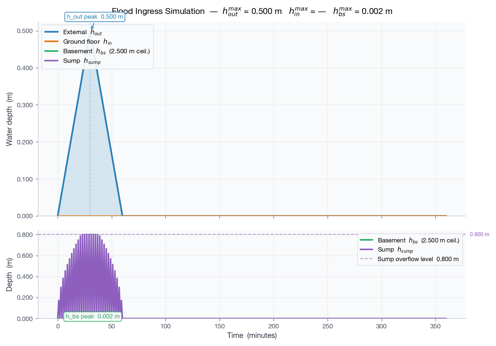

[Animation (GIF)](ex05/out/simulation_animation.gif)

### Timestep sensitivity — sump/pump oscillation

With the explicit-Euler update, the pump discharges **ΔV = Q_pump × Δt**
per step.  If ΔV exceeds the active sump volume **A_sump × h_on**, the
sump drains past zero in one step and refills to h\_on the next — a pure
numerical artefact that can push h\_sump past the overflow crest and
cause spurious basement flooding.

**Stability criterion:**

> Δt  ≤  dt\_crit  =  A\_sump × h\_on / Q\_pump

For Case 05 (A\_sump = 0.5 m², h\_on = 0.10 m, Q\_pump ≈ 0.045 m³/s):

> dt\_crit ≈ 1.1 s  →  recommended Δt ≤ **1 s** (50 % margin)

The figure below shows sump depth time-series for Δt = 60 s down to 0.5 s
(reference).  At Δt = 60 s the sump oscillates to the overflow crest,
producing a spurious 2 mm basement depth.  At Δt ≤ 2 s the level is
smooth and the basement remains dry throughout.

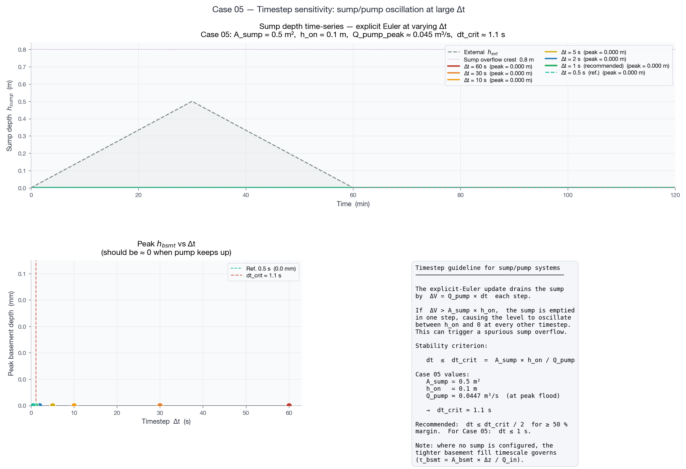

---

## Case 06 — Basement + sump/pump (pump overwhelmed)

**Setup:** same as Case 05 but 100× weaker pump: k\_pump = 100 000.
At peak flood:
Q\_pump = √((5.0 − 3.0) / 100 000) ≈ **0.0045 m³/s** < Q\_in\_max ≈ 0.008 m³/s.

**Expected behaviour:** pump activates but cannot match inflow; sump
level rises quickly (excess rate ≈ 0.003 m³/s over 0.5 m² ≈ 7 mm/s)
and reaches the overflow crest (0.8 m) within ≈ 2 min.  Excess water
spills into the basement, which then fills.  Contrast directly with
Case 05 where the sump never overflows.

**Qualitative check:** sump trace rises to the overflow crest and
saturates there; basement trace becomes positive soon after; sump
overflow crest visible as a horizontal asymptote.

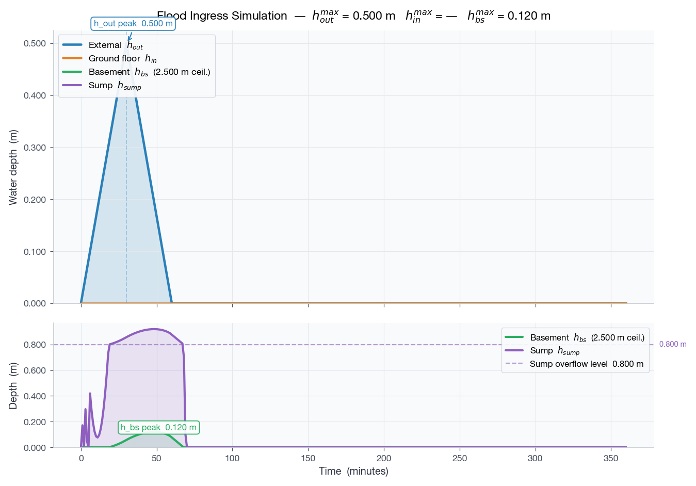

[Animation (GIF)](ex06/out/simulation_animation.gif)

---

## Case 07 — Fragility Monte Carlo: single probabilistic seal (500 replicates)

**Setup:** 50 m² ground floor.  One fragility path `seal_door` —
* Base state: area ≈ 0 m² (sealed)
* Degraded state (seal fails): area = 0.005 m²

Lognormal capacity: median η = 0.5 m, β = 0.3.  Peak external depth
= 0.5 m → P(seal fails) = P(h\* < 0.5 m) = **50 %** by construction.

With a 50 m² floor the characteristic fill time when the seal fails is
τ ≈ 44 min (slow relative to the 30-min rising limb), so the "failed"
cluster reaches a peak interior depth of ≈ 0.25 m — well below the
external peak of 0.5 m.

**Expected behaviour:** bimodal ensemble —
* ≈50 % of replicates: seal intact → peak\_h\_in ≈ 0
* ≈50 % of replicates: seal failed → peak\_h\_in ≈ 0.25 m

**Qualitative check:** histogram has two clearly separated clusters;
sharp discontinuity between P50 (≈ 0) and P75 (> 0); P10–P90 range is
wide.

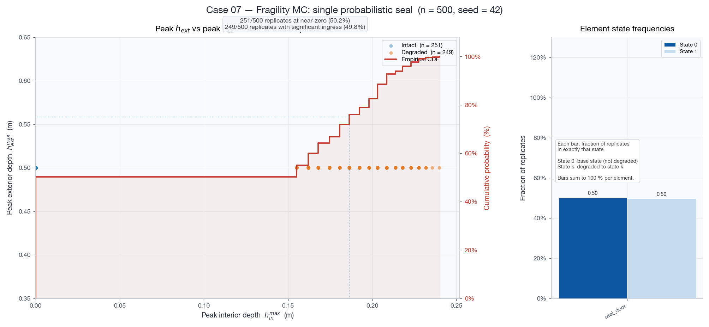

### Percentile summary (peak_h_in, peak_h_basement, total_volume_in)

| metric | P10 | P25 | P50 | P75 | P90 |
| --- | --- | --- | --- | --- | --- |
| peak_h_basement | 0.00000 | 0.00000 | 0.00000 | 0.00000 | 0.00000 |
| peak_h_in | 0.00001 | 0.00001 | 0.00001 | 0.18632 | 0.20862 |
| total_volume_in | 0.00045 | 0.00045 | 0.00045 | 9.31576 | 10.43119 |

### State frequency table

| element | state_0_freq | state_1_freq |
| --- | --- | --- |
| seal_door | 0.502 | 0.498 |

---

## Case 08 — Fragility Monte Carlo: membrane-protected group (500 replicates)

**Setup:** 50 m² ground floor.  Two pathways behind a flood-protection
membrane (group\_id = 1) —
* `airbrick`: sill = 0.1 m, area = 0.006 m²
* `door_gap`: sill = 0.0 m, area = 0.002 m²

Membrane: sill = 0 m, base leakage ≈ 0.  Lognormal overtopping
capacity: median = 0.5 m, β = 0.1 (tight, near-deterministic threshold).
P(membrane overtopped) = **50 %**.

When the membrane fails, total area = 0.008 m² → τ ≈ 28 min; the
"failed" cluster peak interior depth ≈ 0.20 m.

**Expected behaviour:**
* ≈50 % of replicates: membrane intact → total ingress ≈ 0
* ≈50 % of replicates: membrane overtopped → interior fills to ≈ 0.20 m

The tight β = 0.1 means the two clusters are well-separated with
little intermediate probability mass.

**Observed (seed = 42, n = 500):** same 251/249 split as Case 07
(same seed and uniform draws).

**Qualitative check:** same bimodal pattern as Case 07; slightly lower
"failed" cluster peak than Case 07 because the airbrick sill (0.1 m)
delays part of the inflow.

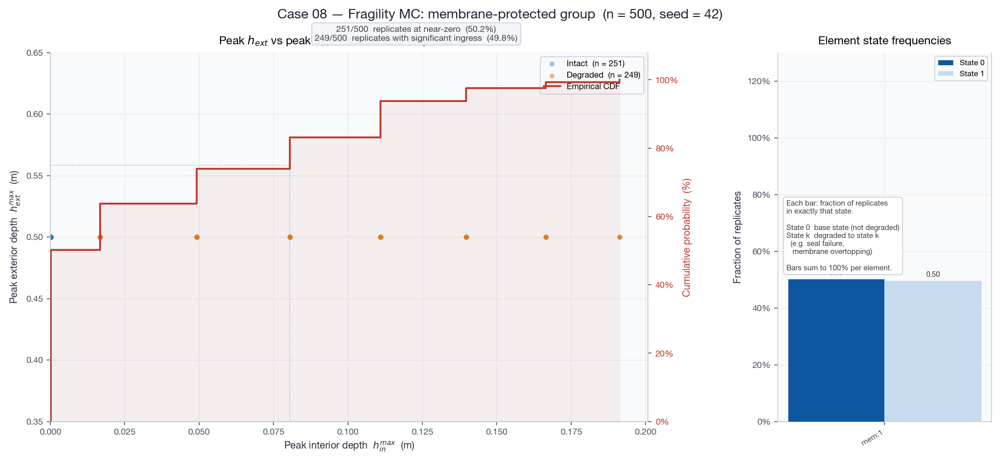

### Percentile summary

| metric | P10 | P25 | P50 | P75 | P90 |
| --- | --- | --- | --- | --- | --- |
| peak_h_basement | 0.00000 | 0.00000 | 0.00000 | 0.00000 | 0.00000 |
| peak_h_in | 0.00009 | 0.00009 | 0.00009 | 0.08037 | 0.11071 |
| total_volume_in | 0.00451 | 0.00451 | 0.00451 | 4.01847 | 5.53535 |

### State frequency table

| element | state_0_freq | state_1_freq |
| --- | --- | --- |
| membrane:1 | 0.502 | 0.498 |

---

## Case 09 — Deterministic membrane (design capacity above flood peak)

**Setup:** identical pathways to Case 08 (airbrick + door\_gap behind membrane
group\_id = 1, 50 m² floor).  The membrane capacity is **deterministic**:
β = 0, median η = **0.6 m** — fixed capacity, no uncertainty.

With the triangular hydrograph peaking at **0.5 m < 0.6 m**, the demand
never reaches the membrane capacity.  The membrane remains intact in every
replicate.

While intact, the membrane presents only its base-state leakage conductance
(area = 1 × 10⁻⁶ m²) to the flood; the pathways behind it are suppressed to
1 × 10⁻⁹ m².  This results in negligible interior depth throughout.

**Comparison with Case 08:** in Case 08 the same membrane has η = 0.5 m and
β = 0.1, giving P(failure) = 50 %.  Case 09 shows that raising the design
capacity by 0.1 m (to just above the flood peak) eliminates all ingress when
there is no uncertainty.

**Qualitative check:** scatter and CDF both cluster at h\_in ≈ 0;
state frequency shows State 0 = 100 %, State 1 = 0 %.

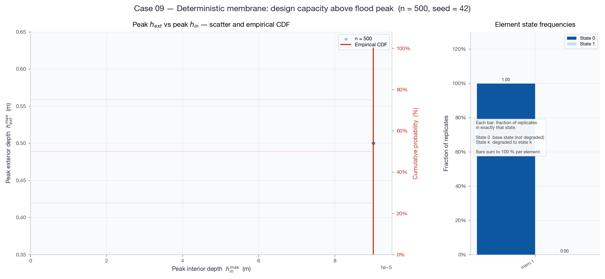

### Percentile summary

| metric | P10 | P25 | P50 | P75 | P90 |
| --- | --- | --- | --- | --- | --- |
| peak_h_basement | 0.00000 | 0.00000 | 0.00000 | 0.00000 | 0.00000 |
| peak_h_in | 0.00009 | 0.00009 | 0.00009 | 0.00009 | 0.00009 |
| total_volume_in | 0.00451 | 0.00451 | 0.00451 | 0.00451 | 0.00451 |

### State frequency table

| element | state_0_freq | state_1_freq |
| --- | --- | --- |
| membrane:1 | 1.0 | 0.0 |

---

## Case 10 — Batch deterministic: 20 hydrographs, single opening

**Setup:** same building as Case 01 (50 m² ground floor, `door_gap` at
sill = 0 m, area = 0.05 m², C_d = 0.6).  The same orifice model is
run over **20 independent hydrographs** with triangular shapes and peaks
ranging from **0.10 m to 1.05 m** in 0.05 m steps.  No fragility or
membrane is applied; the result is purely deterministic.

**Expected behaviour:** peak interior depth increases monotonically
with peak exterior depth.  For small peaks (h\_ext ≤ 0.10 m) the large
orifice tracks the exterior almost perfectly (h\_in ≈ h\_ext).  For
larger peaks the interior fills rapidly and the ratio h\_in/h\_ext also
approaches 1.  The attenuation ratio remains close to 1.0 throughout
because the large orifice (area = 0.05 m²) equilibrates quickly with
the 50 m² floor.

**Qualitative check:** monotonically rising scatter; ratio h\_in/h\_ext
≈ constant near 1; no scatter around the response curve (deterministic).

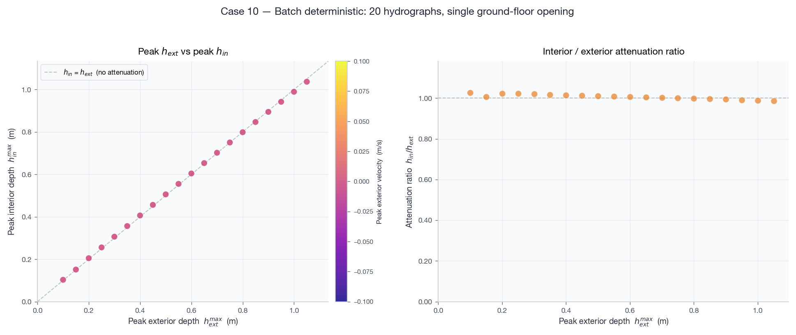

### First 5 rows of batch\_results.csv

| case_id | depth_file | h_peak_ext | h_peak_int | h_peak_basement | v_peak_ext | dur_h010cm_min | dur_h020cm_min | dur_h030cm_min | dur_h040cm_min | dur_h050cm_min | dur_h060cm_min | dur_h070cm_min | dur_h080cm_min | dur_h090cm_min | dur_h100cm_min | dur_h110cm_min | dur_h120cm_min | dur_h130cm_min | dur_h140cm_min | dur_h150cm_min |
| --- | --- | --- | --- | --- | --- | --- | --- | --- | --- | --- | --- | --- | --- | --- | --- | --- | --- | --- | --- | --- |
| 1 | depth_001.csv | 0.1 | 0.1028 | 0.0 | 0.0 | 2.0 | 0.0 | 0.0 | 0.0 | 0.0 | 0.0 | 0.0 | 0.0 | 0.0 | 0.0 | 0.0 | 0.0 | 0.0 | 0.0 | 0.0 |
| 2 | depth_002.csv | 0.15 | 0.1511 | 0.0 | 0.0 | 20.0 | 0.0 | 0.0 | 0.0 | 0.0 | 0.0 | 0.0 | 0.0 | 0.0 | 0.0 | 0.0 | 0.0 | 0.0 | 0.0 | 0.0 |
| 3 | depth_003.csv | 0.2 | 0.2048 | 0.0 | 0.0 | 30.0 | 1.0 | 0.0 | 0.0 | 0.0 | 0.0 | 0.0 | 0.0 | 0.0 | 0.0 | 0.0 | 0.0 | 0.0 | 0.0 | 0.0 |
| 4 | depth_004.csv | 0.25 | 0.2556 | 0.0 | 0.0 | 36.0 | 12.0 | 0.0 | 0.0 | 0.0 | 0.0 | 0.0 | 0.0 | 0.0 | 0.0 | 0.0 | 0.0 | 0.0 | 0.0 | 0.0 |
| 5 | depth_005.csv | 0.3 | 0.3061 | 0.0 | 0.0 | 40.0 | 20.0 | 1.0 | 0.0 | 0.0 | 0.0 | 0.0 | 0.0 | 0.0 | 0.0 | 0.0 | 0.0 | 0.0 | 0.0 | 0.0 |
_…and 15 more rows_

### Batch summary statistics

| metric | min | p10 | p25 | median | p75 | p90 | max |
| --- | --- | --- | --- | --- | --- | --- | --- |
| h_peak_ext | 0.1 | 0.195 | 0.3375 | 0.575 | 0.8125 | 0.955 | 1.05 |
| h_peak_int | 0.1028 | 0.1994 | 0.3438 | 0.5797 | 0.8107 | 0.9469 | 1.0368 |
| h_peak_basement | 0.0 | 0.0 | 0.0 | 0.0 | 0.0 | 0.0 | 0.0 |
| dur_h010cm_min | 2.0 | 29.0 | 41.5 | 49.5 | 53.0 | 54.0 | 54.0 |
| dur_h020cm_min | 0.0 | 0.9 | 24.5 | 39.0 | 45.25 | 47.1 | 48.0 |
| dur_h030cm_min | 0.0 | 0.0 | 6.25 | 28.5 | 37.5 | 41.1 | 43.0 |
| dur_h040cm_min | 0.0 | 0.0 | 0.0 | 18.0 | 30.25 | 35.1 | 37.0 |
| dur_h050cm_min | 0.0 | 0.0 | 0.0 | 8.0 | 23.5 | 28.2 | 32.0 |
| dur_h060cm_min | 0.0 | 0.0 | 0.0 | 0.5 | 15.5 | 22.2 | 26.0 |
| dur_h070cm_min | 0.0 | 0.0 | 0.0 | 0.0 | 8.0 | 16.2 | 20.0 |
| dur_h080cm_min | 0.0 | 0.0 | 0.0 | 0.0 | 0.75 | 9.3 | 14.0 |
| dur_h090cm_min | 0.0 | 0.0 | 0.0 | 0.0 | 0.0 | 3.3 | 8.0 |
| dur_h100cm_min | 0.0 | 0.0 | 0.0 | 0.0 | 0.0 | 0.0 | 3.0 |
| dur_h110cm_min | 0.0 | 0.0 | 0.0 | 0.0 | 0.0 | 0.0 | 0.0 |
| dur_h120cm_min | 0.0 | 0.0 | 0.0 | 0.0 | 0.0 | 0.0 | 0.0 |
| dur_h130cm_min | 0.0 | 0.0 | 0.0 | 0.0 | 0.0 | 0.0 | 0.0 |
| dur_h140cm_min | 0.0 | 0.0 | 0.0 | 0.0 | 0.0 | 0.0 | 0.0 |
| dur_h150cm_min | 0.0 | 0.0 | 0.0 | 0.0 | 0.0 | 0.0 | 0.0 |

---

## Case 11 — Batch + fragility MC: 20 hydrographs × 50 replicates, membrane

**Setup:** same membrane-protected building as Case 08 —
* `airbrick`: sill = 0.1 m, area = 0.006 m², behind membrane group 1
* `door_gap`: sill = 0.0 m, area = 0.002 m², behind membrane group 1
* Membrane: sill = 0 m, base leakage ≈ 0; lognormal capacity
  **η = 0.5 m, β = 0.1** (tight near-deterministic threshold)

The same 20 hydrographs as Case 10 are used.  For each hydrograph,
**50 Monte Carlo replicates** are drawn (seed = 42), giving
**1 000 total simulations**.  The seed is reset identically for each
hydrograph, making the per-hydrograph MC independent.

**Expected behaviour** (fragility curve):
* h\_ext ≪ 0.5 m  →  membrane never overtopped  →  P(failure) ≈ 0 %,
  peak\_h\_in ≈ 0 for all replicates
* h\_ext ≈ 0.5 m  →  P(overtopping) ≈ 50 % (median capacity = 0.5 m)
  →  bimodal peak\_h\_in (≈50 % near 0, ≈50 % positive)
* h\_ext ≫ 0.5 m  →  membrane almost certainly overtopped
  →  P(failure) → 100 %, peak\_h\_in rises with h\_ext

The left panel shows the replicate cloud with P10 / P50 / P90 bands.
The right panel shows the fragility curve — the fraction of replicates
with significant ingress as a function of peak exterior depth.

**Comparison with Case 08:** the h\_ext = 0.5 m slice of Case 11 is
statistically equivalent to Case 08 (same building, same hydrograph,
same seed, n = 50 replicates).

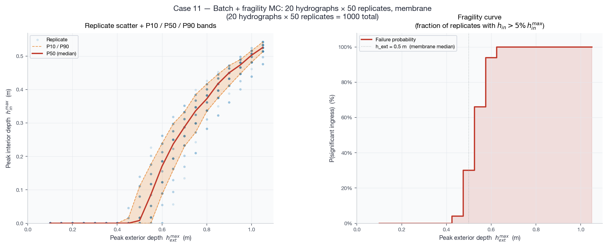
